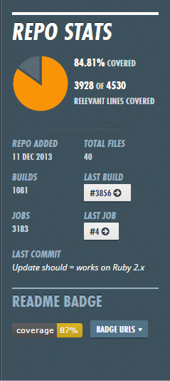
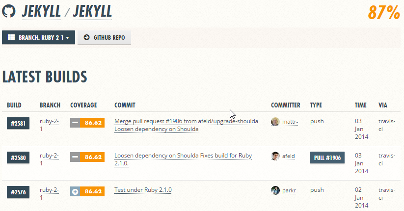

#Verification and Validation

In this report, we will explain verification and validation of software and how Jekyll implements tests.

##Verification vs Validation

**Verification** - "The evaluation of whether or not a product, service, or system complies with a regulation, requirement, specification, or imposed condition. It is often an internal process." (https://en.wikipedia.org/wiki/Verification_and_validation)

**Validation** - " The assurance that a product, service, or system meets the needs of the customer and other identified stakeholders. It often involves acceptance and suitability with external customers." (https://en.wikipedia.org/wiki/Verification_and_validation)

But what does this mean?
Verification stands as understanding if the software developed meets the specifications given at the beggining.
Validation is knowing if the custumores/stakeholders(who might benefit with the software) are happy with the software developed, if it meets their expectations.

#Standardization of Testing

Jekyll has standardized their way of testing. Contributors are asked to make tests when creating a small fix to an existing feature or creating a brand new one. Standardization of the way one should make a test is useful, because everyone involved will know what to do. The Jekyll test suite is making use of [*Shoulda*](https://github.com/thoughtbot/shoulda/), [*RSpec*](https://github.com/rspec/rspec), [*Cucumber*](https://cucumber.io/) and [*MiniTest*](https://github.com/seattlerb/minitest).

Shoulda and MiniTest are used to make units tests, which reside in the **test** folder. RSpec is used to mock objects and supports stubs, fakes, spies and proxies. Cucumber is a tool for running tests written in a plain language, that can be read by anyone. These tests can be found in the **feature** folder.

##Software Testing

To check if the software is well implemented, Jekyll set a wide variety of tests. We will expose them in order to understand where they focus on.

###Controlability

**Controlabilty** determines the work it takes to set up and run test cases and the extent to which individual functions and features of the system under test (SUT) can be made to respond to test cases. 
Jekyll deals with the matter testing every class, module and package, one at a time. Jekyll tests every render, every parser to ensure everything is correct. (There is more info on this in the previous reporst. Check https://github.com/jmepg/jekyll/tree/master/ESOF-docs for detailed description).  This allow to have more control over what is going on.

This ensures that Jekyll component testing is controlable.

###Observability 

**Observability** determines the work it takes to set up and run test cases and the extent to which the response of the system under test (SUT) to test cases can be verified.

Jekyll is also using a continuous integration platform called [*Travis*](https://travis-ci.org/). The config file **.travis.yml** for [*Travis*](https://travis-ci.org/) can be found in the root directory. This way every pull request will be automatically tested on all available tests. [*Travis*](https://travis-ci.org/) will also check on code style with [*Rubocop*](https://github.com/bbatsov/rubocop). If a test fails or the code doesn’t satisfy the [*GitHub style guide*](https://github.com/styleguide/ruby) for Ruby, the pull request will not be merged.

We used [*Coveralls*](coveralls.io) to check Jekyll's test converage. 

[*Coveralls*](coveralls.io) also allows to go through each branch and analyse each one independantly. 

This is just an example of the analisys of a Jekyll branch. As you can see. The coverage tests where made via [*Travis*](https://travis-ci.org/).

This way, Jekyll's tests are certain to retrieve useful and useable information about it's features.

